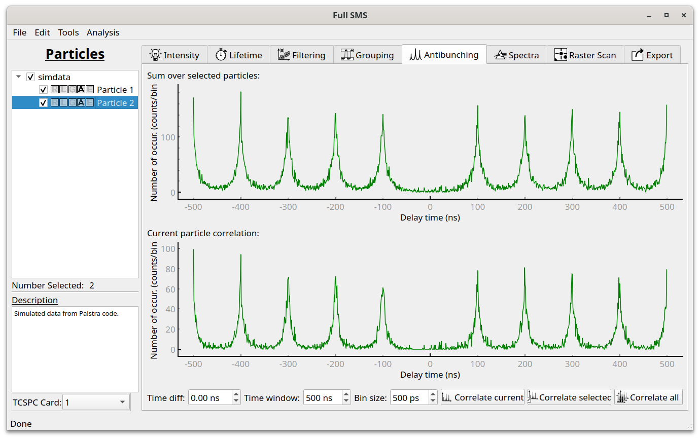

Antibunching analysis
=====================

In the Antibunching tab, the second order photon correlation can be calculated. This requires data measured in two
channels. The window over which the calculation is done can be adjusted along with the bin size. A time difference
can also be input for cases where there is some delay between the two channels (seen as the "zero peak" not lining up
with the zero delay time.)

