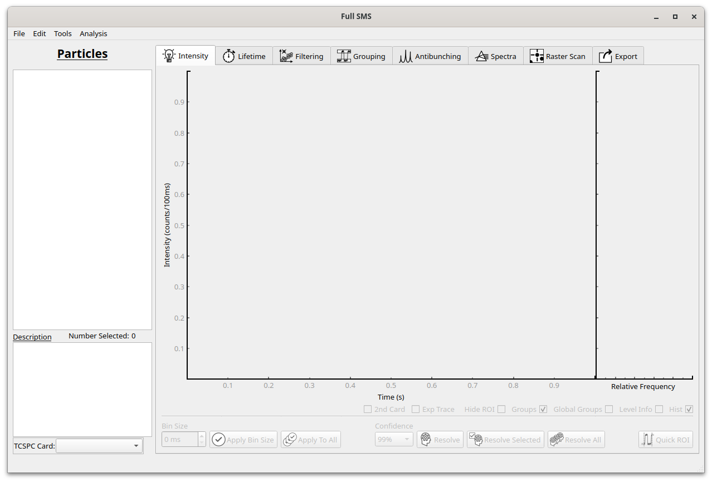

Basic overview
==============

The GUI looks like this:

To open a file, click on File..Open HDF5.

* A list of particles will appear in the left pane.
* Different types of measurements can now be viewed and analysed using the tabs on the right.
* Data can also be exported using the Exporting tab.
* If two measurement channels were used, the secondary channel can be selected under "TCSPC card".
* For more information on the different types of analyses see the relevant section in the :doc:`userguide`.