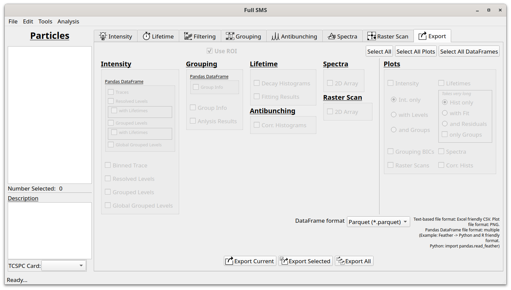

Exporting data
==============

The Exporting tab is used for exporting the results of analysis for further processing, creating figures, etc. The
different options become available as different analyses are performed. The format is generally CSV files (or images in
the case of plots) but for some data, a `Pandas <https://pandas.pydata.org>`_ dataframe format can be chosen. The
default file type for this is Parquet but others can be chosen if preferred.

