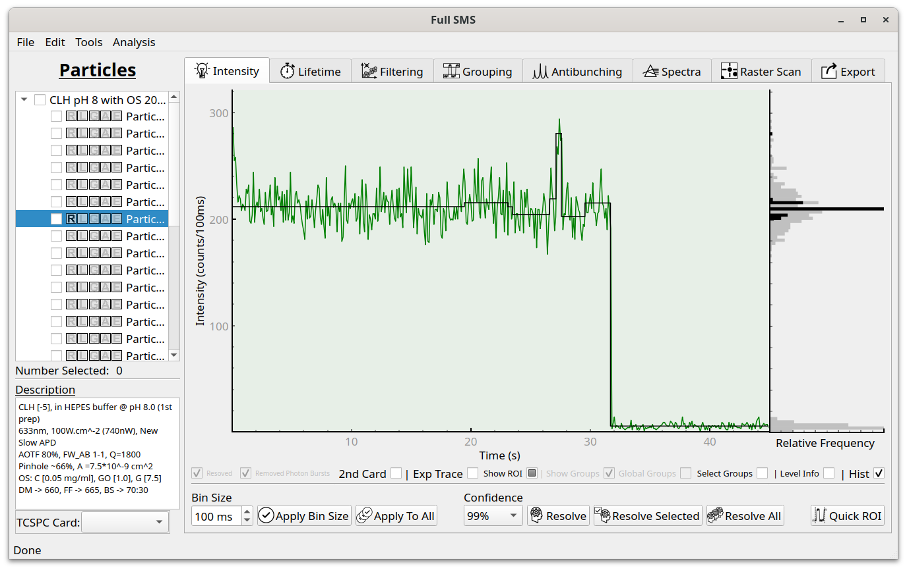

Data filtering
==============

After resolving levels and fitting their lifetimes, the resulting statistics can be inspected and the data filtered in
the Filtering tab. The available parameters are the number of photons in the level, the level intensity, the fitted
(average) lifetime of the level, the Durbin-Watson parameter, the Chi-squared value and the fitted IRF shift. For
example, clicking on "Intensity Distribution" and then on "Plot Distribution" shows the following:

Different values can also be viewed using a scatter plot by selecting the relevant features under "Two Feature
Investigation" and clicking "Plot". For example, an intensity-lifetime plot looks like this:

This data can also be filtered, for example based on minimum and maximum lifetime values:

For an intensity-lifetime plot, the data can also be fit with a linear regression:

Finally, the intensities can be normalized to the fitted lifetime. If this is only done to correct for drift, "Only
Drift" can be left selected before clicking "Apply Norm.". This moves the points below the fit line onto the line:

If "Only Drift" is unchecked, all points will be moved onto the line during normalization:

