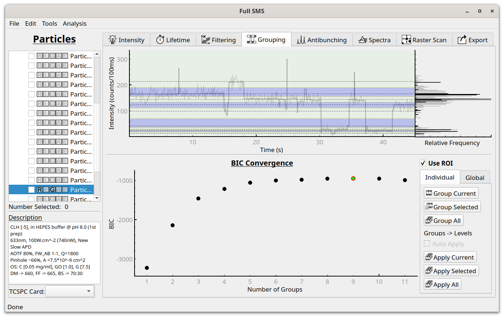

Intensity level grouping
========================

After resolving intensity levels, they can be grouped (clustered) together using agglomerative hierarchical
clustering (AHC). This is done in the Grouping tab.

To group levels on an individual particle basis, use "Group Current", "Group Selected" or "Group All" buttons to
group levels for the current, selected or all particles.

After performing grouping, the groups are displayed on the intensity trace as dashed lines, with alternating purple and
no coloring indicating the intensities included in each group. Below the intensity trace, the Bayesian information
criterion (BIC) values used in the AHC algorithm are shown. The algorithm starts with one group and progressively
increases
the number until a maximal BIC is reached. This represents a balance between accurately fitting the data and having
as few groups as possible. For detail sees Watkins and Yang 2005 [#]_. The option that is currently applied is indicated by the red
outline, but the user can apply different solutions by clicking on any of the other
circles. In this example, the best solution is also applied. On the bottom right are
options to include only the ROI of each trace in the analysis, to group the levels of the
current, selected or all particles, and to “apply” the groups to the levels (i.e., change
each level’s intensity to that of its associated group). After performing the grouping,
the groups can also be viewed in the Intensity tab.

.. [#] Watkins and Yang, J. Phys. Chem. B 2005, 109, 617-628 (http://pubs.acs.org/doi/abs/10.1021/jp0467548)

