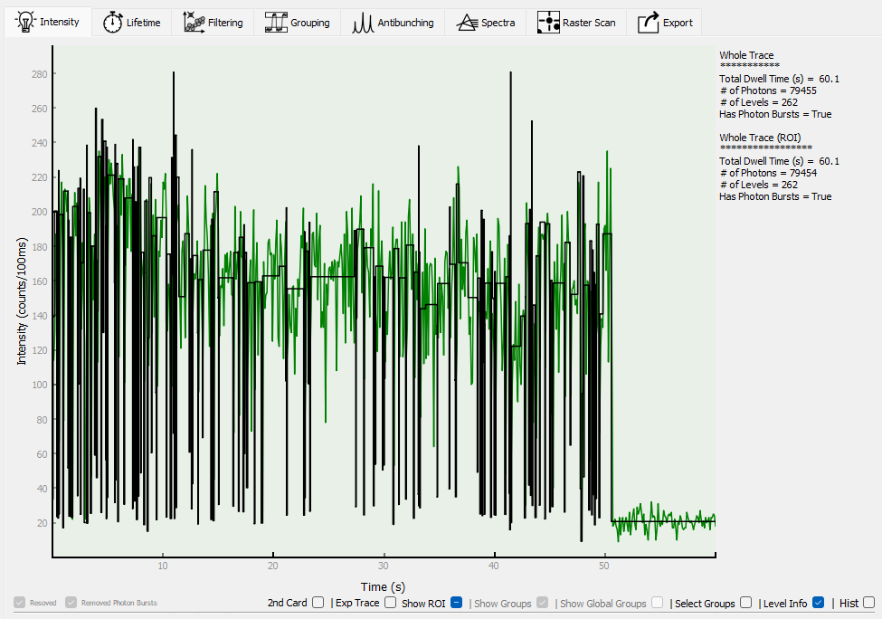
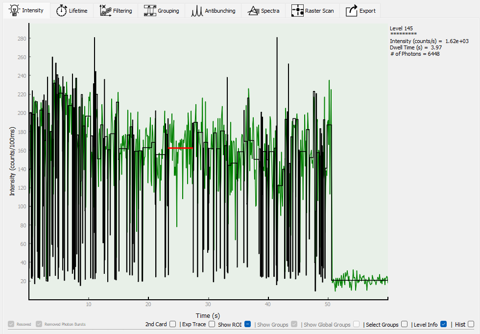
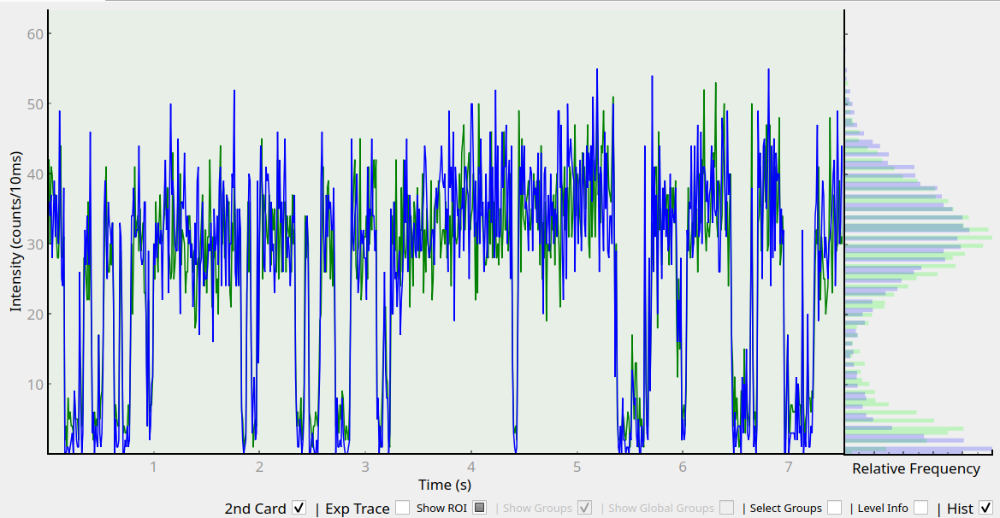

Intensity level resolution
==========================

.. image:: images/intensity.png
   :alt: Intensity tab in the GUI
   :align: left

The Intensity tab shows the binned fluorescence intensity. The bin size can be changed using the control in the lower
left, and applied to either the current particle or to all particles (this binning is only used for visual display
and does not affect the change-point analysis).
If two channels were recorded, the second channel intensity can be shown along with the first by selecting "2nd card".
If a pre-binned trace is included in the measurement file, it can be shown by selecting "Exp trace". The :doc:`region
of interest <roi>` can be hidden or edited by selecting "Show ROI". On the right hand side of the trace, a histogram
of intensities are shown.

Intensity levels can be resolved using change-point analysis in the "Intensity" tab. This will happen automatically
upon loading a dataset, unless aborted by the user. First choose a confidence level,
then click "Resolve" to resolve the current particle levels, "Resolve Selected" to resolve all selected particles, or
"Resolve All" to resolve the levels for all particles.

.. image:: images/resolved.png
   :alt: Intensity tab in the GUI after resolving levels
   :align: left

Resolved levels are now displayed over the intensity trace. The change-point analysis uses the algorithm from Watkins
and Yang [#]_  and the confidence is a measure of how strict the algorithm is with deciding on a change point. A lower
confidence will therefore result in more fitted levels - it is up to the user to decide the best value for their
application. The pane on the right now shows a histogram of the binned intensities
(grey) and a level-duration weighted distribution of the resolved intensity
levels (black). More information is available about the whole trace, or a selected level, by selecting "Level Info":

Whole trace info:

Single level info:

Two-channel data can be displayed by selecting "2nd Card":

Sometimes, after resolving levels, a dialog will pop up to let you know that one or more "photon bursts" have been
detected:

.. image:: images/photonburst_dialog.png
   :alt: Intensity tab in the GUI after resolving levels
   :align: center

"Photon bursts" are extremely short, high intensity spikes that are sometimes found after resolving levels. They can
be removed automatically.

Before:

.. image:: images/photonburst.png
   :alt: Intensity tab in the GUI after resolving levels
   :align: left

After:

.. image:: images/nophotonburst.png
   :alt: Intensity tab in the GUI after resolving levels
   :align: left

.. [#] Watkins and Yang, J. Phys. Chem. B 2005, 109, 617-628 (http://pubs.acs.org/doi/abs/10.1021/jp0467548)