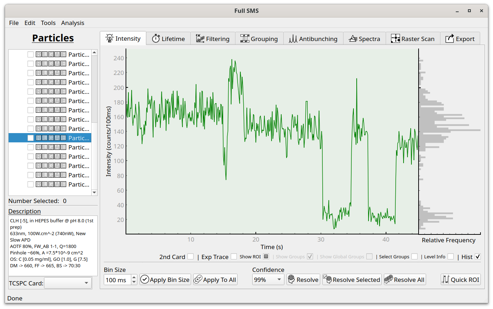
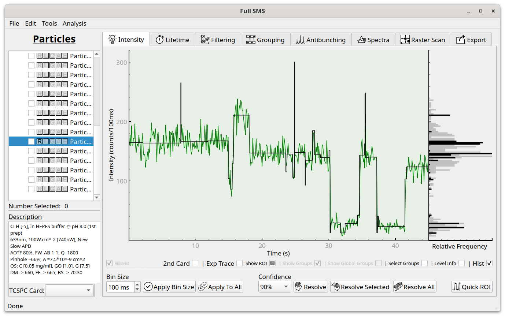
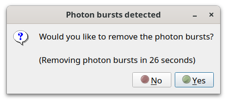
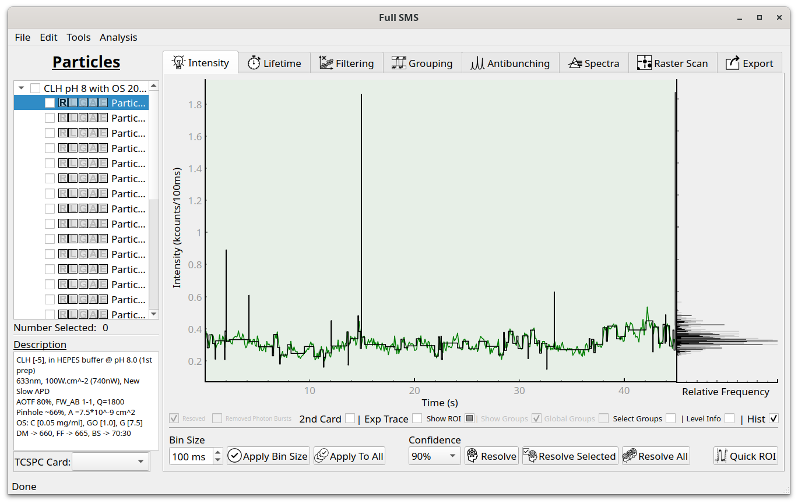
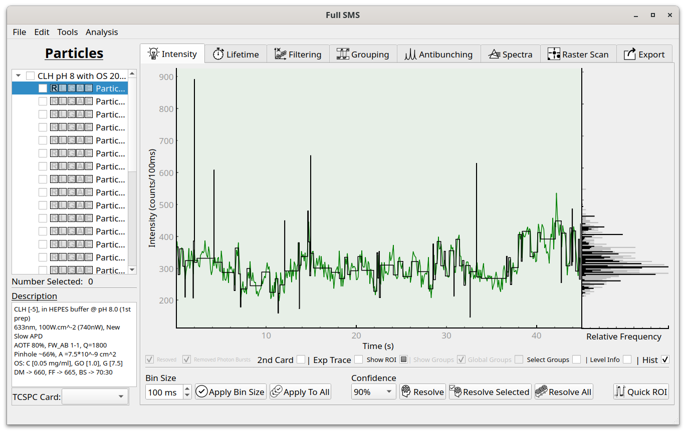

Intensity level resolution
==========================

The Intensity tab shows the binned fluorescence intensity. The bin size can be changed usiong the control in the lower
left, and applied to either the current particle or to all particles. If two channels were recorded, the second channl
dfdfdf intensity can be shown along with the first by selecting "2nd card". If a pre-binned trace is included in the
measurement file, it can be shown by selecting "Exp trace". The :doc:`region of interest <roi>` can be hidden or edited
by selecting "Show ROI". On the right hand side of the trace, a histogram of intensities are shown.

Intensity levels can be resolved using change-point analysis in the "Intensity" tab. First choose a confidence level,
then click "Resolve" to resolve the current particle levels, "Resolve Selected" ot resolve all selected particles, or
"Resolve All" to resolve the levels for all particles.

Resolved levels are now displayed over the intensity trace. The change-point analysis uses the algorithm from Watkins
and Yang [#]_  and the confidence is a measure of how strict the algorithm is with deciding on a change point. A lower
confidence will therefore result in more fitted levels - it is up to the user to decide the best value for their
application.

Sometimes, a dialog will pop up to let you know that one
or more "photon bursts" have been detected:

"Photon bursts" are extremely short, high intensity spikes that are sometimes found after resolving levels. They can
be removed automatically.

Before:

After:

.. [#] Watkins and Yang, J. Phys. Chem. B 2005, 109, 617-628 (http://pubs.acs.org/doi/abs/10.1021/jp0467548)