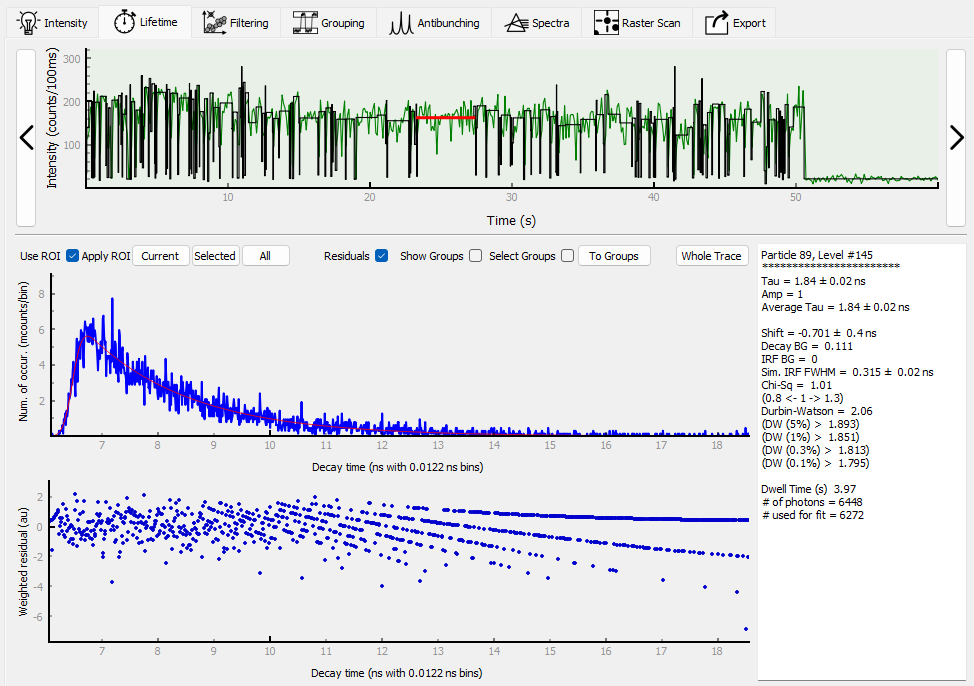
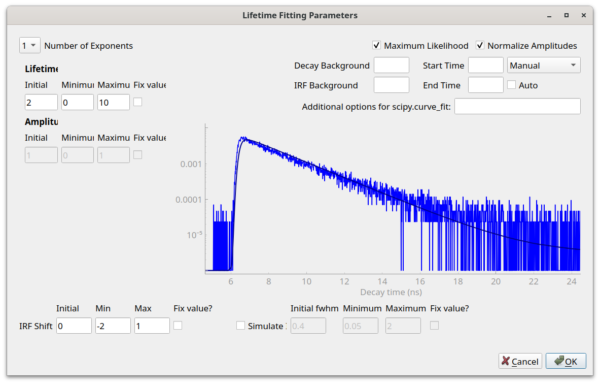

Lifetime fitting
==============================

Below is a guide to performing lifetime fits using the GUI. For more information on how to get good fits, see this guide:

.. toctree::
    :maxdepth: 2

    get_good_fits

Lifetime fitting is performed using the Lifetime tab:

The decay histogram is displayed for the whole trace or for individual levels or grouped levels.
The fitted intensity trace is also displayed at the top in order to navigate trough levels or groups (click on the
level, or use the left and right arrows next to the upper plot as well as the "To Groups" and
"Whole Trace" buttons). Below the displayed intensity trace are options to apply the trace ROI for the current,
selected, or all particles (i.e., to include only the ROI photons in the lifetime fits), as well as the option to show
the fit residuals plot, and options to show the groups instead of the resolved levels in the intensity trace plot, so
that they can be selected and their decay histograms and fitting results viewed.

An IRF can be loaded by clicking on "Load IRF". Before performing a fit, click on "Fitting Parameters".
This brings up a dialog:

Different fitting parameters can here be interactively adjusted. At the top left is the number of lifetime exponents
that should be fit. The parameters that are optimized as part of the fit
routine are the lifetimes, amplitudes, IRF shift and, if the option to simulate an IRF is chosen, the simulated IRF
full-width at half maximum (fwhm). Initial values as well as boundaries can be specified for these parameters. Values
can be specified for the decay and IRF background values, or these fields can
be left blank, in which case the values will be automatically be determined prior to fitting. The start and endpoints
for fitting can also be specified or set to automatically determined values. Lastly, at the top
right are options to use maximum-likelihood fitting and to normalise the lifetime amplitudes (see
:doc:`get_good_fits` for details on these options).

After choosing suitable starting values, click on "OK" to close the dialog. Now a fit(s) can be performed by clicking on
the relevant "Fit ..." button. Once completed, the fitted curve will be displayed along with the residuals, and the fit
results will be printed in the box on the right:

Fitted parameters are returned as well as the goodness-of-fit parameters of Chi-squared and the Durbin-Watson parameter.
The residuals are also plotted for easy visual inspection of the goodness-of-fit.

