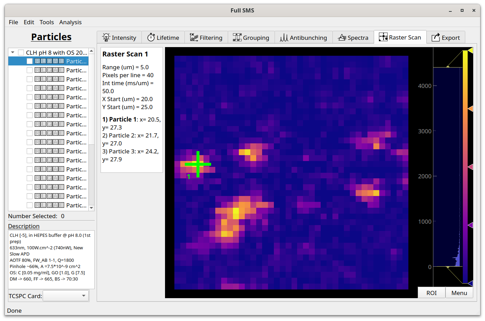

Viewing raster scans
====================

Raster scans can be viewed in the Raster Scan tab. The intensity scan is shown using an adjustable color map and the
current particle's position is indicated. The raster scan parameters are also shown on the left hand side.

