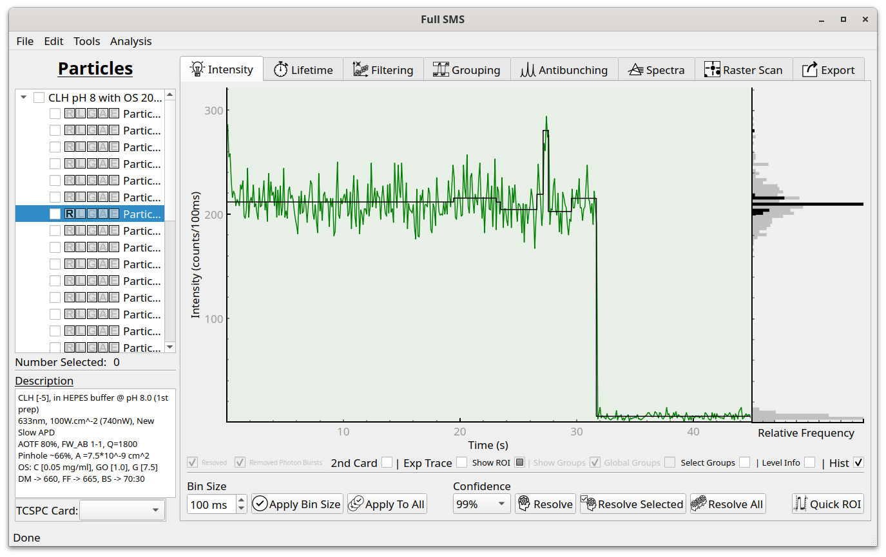
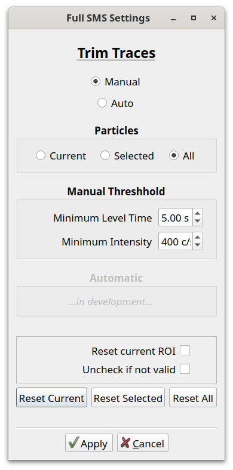
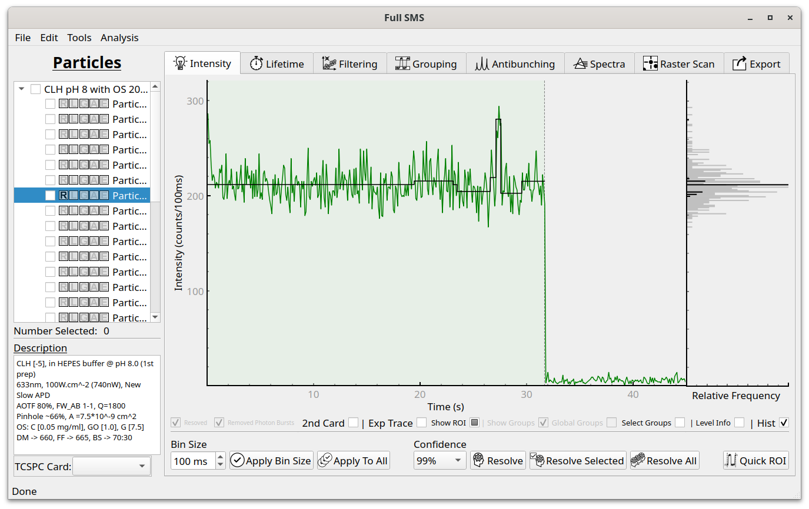

Region of interest
==================

Often a particle will photobleach or enter a prolonged dark state that lasts until the end of a measurement.
Including these parts of the intensity traces in statistics can skew results and therefore it is desirable to remove
them automatically. For this purpose Full SMS provides a region of interest (ROI) functionality, which allows a
portion of each trace to be excluded manually or automatically from being included in the analysis and export.

The ROI is displayed as a green shading. By default, the entire trace is included in the ROI. To manually change the
ROI, click the "Show ROI" checkbox and it will say "Edit ROI". Now a dashed line will appear at the right of the
trace, which can be dragged to an arbitrary position. An ROI can also automatically be set by clicking "Quick ROI".
This brings up a dialog:

Currently, only manual specification of ROI criteria is supported. The two criteria are minimum level time, which is
the minimum length the photobleached part of the trace should be for it to be trimmed, and the minimum intensity,
which is the intensity cutoff below which the particle is considered photobleached. In the dialog, the ROI can also
be reset to the default of including the whole trace. In the example shown above, applying the ROI looks like this:

