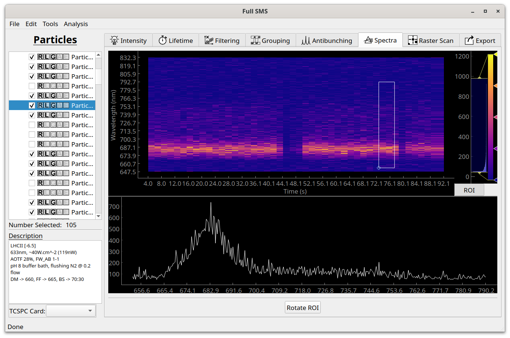

Viewing spectra
===============

At the moment, Full SMS only provides functionality to view spectral time traces in the "Spectra" tab and no analysis
can be done. This is on our list of future additions! The display does allow for viewing spectra as a function of
wavelength by defining an ROI. To do this, click on "ROI" and then on "Rotate ROI" if necessary to view the spectrum
as a function of wavelength. Reshape the ROI by dragging its corner. The color bar can be adjusted on the left hand
side, where a histogram of pixel values is also shown.

